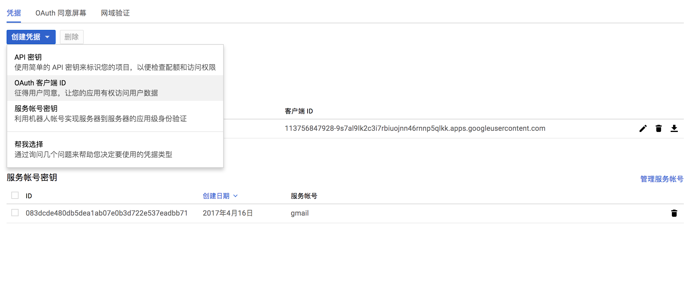

1. 你需要创建一个新的post：填写的Monthly的内容到md文件，可以用`hexo new [monthly-issue-xxx]`的方式创建新的Post，可以用`hexo s`，查看post是否能被正确显示在hexo的发布中
2. 确保.credentical文件存在：如果不存在，请前往`https://console.developer.google.com/`，并在凭据（credentials）Tab下创建OAuthID，将产生的文件下载下来，重命名为`.credentical`并放在`email`目录下，参考后面截图
3. 发送email，运行email下的cli.js，请指定email产生文件的路径的，issue的描述文字等等，详细的请查看cli.js源码 
4. 如果发送失败，请确保.token文件存在:如果不存在，请先使用正确的cli按照正确的参数执行一遍，命令行中会提示一个Oauth 授权网站，授权后网页会给你一个授权的Token值，请将这个值粘贴到命令行中，程序会自动创建token文件，然后请再运行一遍刚才的命令，应该可以被正常执行了
5. 如果发送失败，并显示`Invalid Grant`类似的命令，有可能是是token过期的原因，请先删除email下的.token文件，并参考第四步，重新获取token

